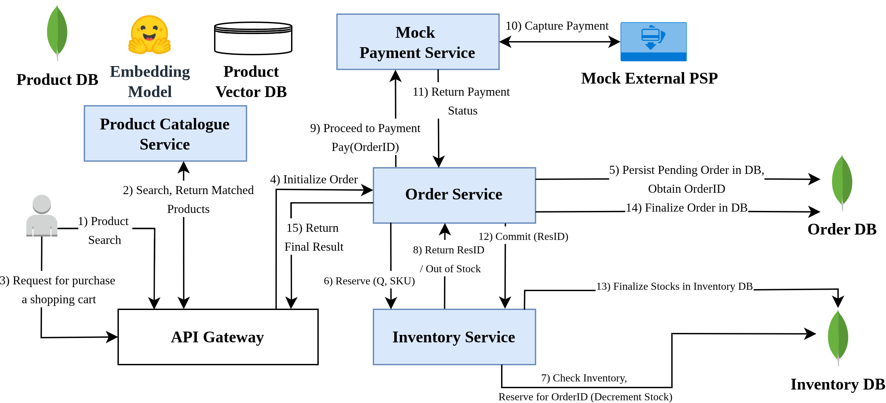

# Microservice Systems & LLM-Based Multi-Agent Systems Benchmarking

In this project, we're going to develop a Microservice (MS) and deploy in cloud.

A case study for retail supply chain management is implemented.

## Microservice System Architecture:

### Service Communications:

1. Synchronous via REST API call
3. Asynchronous via Message Broker using RabbitMQ

